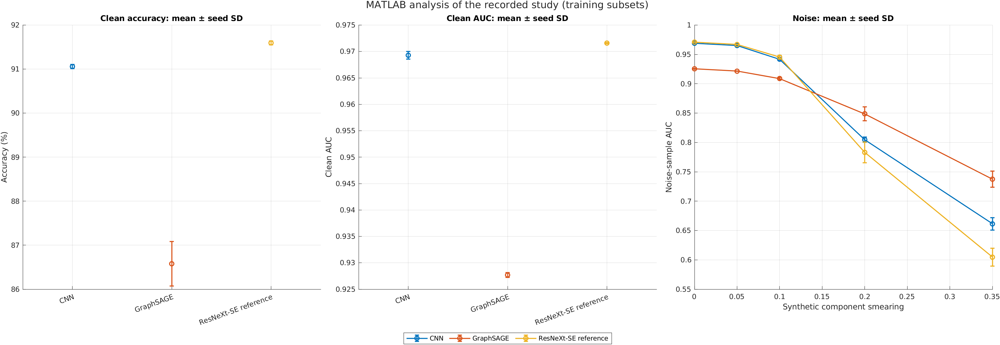

# Top-quark detection with deep learning and big data

[](https://github.com/AstroAli5/top-quark-tagging-ai-challenge/actions/workflows/tests.yml)

A MATLAB project by **Ali Mohamed**, developed for [Challenge Project 238](docs/PROJECT238.md).

**Status:** the author’s submitted version was not accepted. The review identified
missing MATLAB big-data steps. The repaired route now completes a
[verified one-epoch run](experiments/project238-full/) on **all 1,211,000 training
and 404,000 test jets**: accuracy **90.23%**, AUC **0.97395**. Tests and independent
prediction checks pass. This establishes full-data execution; a longer,
multi-seed full-data study and reviewer acceptance remain unconfirmed.

**Question:** how do an image CNN and a particle GraphSAGE model respond when the
same jets have their measured momenta perturbed?

The required workflow is the MATLAB datastore CNN. The CNN/GraphSAGE comparison
is the main research extension. An optional, independently
implemented [ResNeXt-SE reference](docs/WINNER_COMPARISON.md) explores ideas from
Adit Shah's 2025 winning project, with attribution.

| What you want to do | Start here |
| --- | --- |
| See the MATLAB pictures and main findings | [Figure gallery](docs/FIGURES.md) · [Results](docs/RESULTS.md) |
| Understand the project or present it | [Student walkthrough](docs/WALKTHROUGH.md) |
| Run the required MATLAB data workflow | `run_project238` below · [Verified full-source run](experiments/project238-full/) · [Small demonstration](experiments/project238-demo/) |
| Run the two core models | The short instructions below |
| Reproduce or extend the research | [Experiment protocol](docs/EXPERIMENT_PROTOCOL.md) · [Next experiments](docs/NEXT_EXPERIMENTS.md) |
| Inspect the optional quantum comparison or larger-data controls | [Measured Qiskit pilot](experiments/quantum-pilot/) · [Scaling](docs/SCALING.md) |
| Check possible competition entry routes | [Current requirements and fit](docs/COMPETITIONS.md) |

## Verified result

Mean scores across three training seeds, using 50,000 training jets and all
404,000 official test jets:

| Model | Clean accuracy | Clean AUC |
| --- | ---: | ---: |
| CNN | 91.06% | 0.96929 |
| GraphSAGE | 86.58% | 0.92769 |
| ResNeXt-SE reference | 91.59% | 0.97159 |

The reference has the highest clean score. GraphSAGE has the highest AUC under
20% and 35% synthetic smearing in each training run. Read the
[results and uncertainty](docs/RESULTS.md) or inspect the
[saved evidence](experiments/official-study/).



MATLAB generated this chart and its summary tables. Clean evaluation uses
**404,000 test jets**; noise evaluation uses **10,000**; both use three training
seeds. Noise repeats are averaged within each fitted seed. The [gallery](docs/FIGURES.md)
labels the origin and experiment behind every available figure.

**Verified follow-ups:** the [five-seed core report](experiments/seed-extension/)
supports the same clean/noise trade-off. With [100,000 training jets](experiments/scaling/),
the same three original seed labels gave mean accuracy of **91.63% for CNN**
and **87.40% for GraphSAGE**. That experiment also uses more training updates;
its separate report includes uncertainty and measured memory use.

## Check the saved results first

Requirements: **MATLAB R2024a+ and Deep Learning Toolbox**, with the JVM enabled
(the normal desktop or batch session; do not use `-nojvm`).
Statistics and Machine Learning Toolbox is optional for `rocmetrics`; the same
tie-aware ROC calculation is available without it.

Clone or download this repository and run in MATLAB:

```matlab
verify_results
summarize_matlab
```

The [included seed-101 CNN and 256-jet sample](checkpoints/) require no extra
data download or retraining. The first command verifies their hashes and restores
the saved CNN predictions. Its printed scores describe only that small test sample.
The second command makes the study summary tables and figure in MATLAB.

## Run the MATLAB big-data route

Install **Python 3.11** and the packages in `requirements.txt`, then configure
MATLAB's `pyenv` to use that Python installation with
`ExecutionMode="OutOfProcess"` (restart MATLAB first if Python is already loaded
in-process). This isolates incompatible HDF5 libraries. MATLAB calls Python using
`pyrun` to verify/download the official data and convert bounded blocks to Parquet.
The pipeline then uses `parquetDatastore`, a tall image transform, and
folder-labelled `imageDatastore` objects for CNN training and evaluation.

```bash
python -m pip install -r requirements.txt
```

A short real-data demonstration (already [executed and independently checked](experiments/project238-demo/)):

```matlab
cfg = project238Config;
cfg.trainCount = 2000;
cfg.validationCount = 500;
cfg.testCount = 1000;
cfg.epochs = 1;
cfg.dataDir = fullfile(cfg.rootDir,'data','project238_demo');
cfg.outputDir = fullfile(cfg.rootDir,'runs','project238_demo');
run_project238(cfg)
```

The unmodified `project238Config` selects all 1,211,000 training rows, 10,000
validation rows and all 404,000 test rows for 12 epochs. The verified full-source
run used **one epoch and batch size 100**; the 12-epoch default remains unrun.
Its CPU measurements were 20.61 minutes for image preparation, 35.32 minutes for
training, and 4.76 GiB MATLAB-process peak memory, with a separate 0.47 GiB Python
peak. These are measured conditions, not minimum hardware requirements.
See the [full result and reproduction command](experiments/project238-full/) and
[requirements map](docs/PROJECT238.md). The route writes many image files and
needs substantial disk/time.
Existing fitted output folders are protected from accidental overwriting.

The [original CNN/GraphSAGE stages](docs/WALKTHROUGH.md) remain available through
`run_all`. Their in-memory MAT input is an educational/reproduction option.
The optional reference and quantum studies are separate research extensions.

## Reproduce the larger study

<details>
<summary>Advanced: training budget, commands, and computing requirements</summary>

The [frozen protocol](docs/EXPERIMENT_PROTOCOL.md) uses **50,000 official training
jets, 10,000 official validation jets, the full official test partition, and
three training seeds**. Each of the three models trains for 12 epochs.
This remains a training-subset study; it does not train on all 1.2 million jets.

```bash
python scripts/prepare_official.py
```

Then in MATLAB:

```matlab
run_experiment(101)
run_experiment(202)
run_experiment(303)
```

Finally:

```bash
python -m pip install matplotlib
python scripts/summarize_experiment.py --input runs --output results/official-study
```

The downloader verifies all three source files (about 1.73 GB total). Allow
additional disk for prepared data and models. The larger reference model caches
about 4 GB of input images; use a machine with at least 16 GB RAM.
Existing experiment models are preserved: choose a new output folder to rerun.
The [research workflow](.github/workflows/research.yml) runs the same study in MATLAB
on GitHub Actions. It defaults to **CNN and GraphSAGE only**. Select
**include_reference** to also train the reference and produce the combined summary.
The recorded reference took about 149 CPU minutes per seed, versus roughly
9.4 minutes for CNN and 5.7 minutes for GraphSAGE; runner conditions vary.
The MATLAB commands above explicitly reproduce the original three-model study.

</details>

## Find your way around

| Location | Purpose |
| --- | --- |
| Root commands | `run_all`, `run_experiment`, `run_small_benchmark`, `run_winner_comparison`, `projectConfig` |
| `src/pipeline/`, `src/core/` | Seven stages and shared image/graph helpers |
| `src/reference/` | Optional ResNeXt-SE comparison |
| `src/experiment/` | Official test evaluation in bounded chunks |
| `scripts/`, `notebooks/` | Download, conversion, summaries, and Colab preparation |
| `docs/FIGURES.md` | One gallery for final-study, small-run, and historical figures |
| `docs/` | Walkthrough, results, protocol, and attribution |
| `experiments/official-study/` | Verified metric tables, uncertainty summaries, figures, and run provenance |
| `archive/original-results/` | Unchanged historical outputs, separated from current evidence |

Root commands call `setupProject` automatically. Call it first when exploring
implementation functions directly.

## Checks and interpretation

```bash
python -m unittest discover -s tests -p "test_*.py" -v
```

```matlab
results = runtests('tests');
assertSuccess(results);
```

Tests check data boundaries, score mapping, tied-score AUC, graph batching,
noise pairing, and small end-to-end runs. Their synthetic scores are not
physics results. Synthetic momentum smearing measures sensitivity to one
perturbation; it is not a calibrated detector simulation. Read the
[results discussion](docs/RESULTS.md) before making architecture comparisons.

Data: [Top Quark Tagging Reference Dataset](https://doi.org/10.5281/zenodo.2603256)
(CC BY 4.0). Background: [GraphSAGE](https://arxiv.org/abs/1706.02216) and
[Colin Crovella's MATLAB reference demo](https://www.mathworks.com/matlabcentral/fileexchange/181442-graphsage-classifier-for-top-quark-tagging).
See [concepts](docs/CONCEPTS.md), [reference-model attribution](docs/WINNER_COMPARISON.md),
[AI assistance](docs/AI_ASSISTANCE.md), and [MATLAB / Colab / Qiskit](docs/PLATFORMS.md).

[MIT license](LICENSE) · [Citation metadata](CITATION.cff)
