# Figure gallery

Every figure below is linked to its experiment. A small demonstration and a
large evaluation can give different rankings; their pictures are not interchangeable.

## Main study summary — verified MATLAB export

MATLAB recomputed the 50k study's means, training-seed standard deviations and
Student-t intervals from the recorded per-seed measurements. Python/SciPy
independently checked the tables. Clean AUC uses all 404,000 test jets; noise AUC
uses the first 10,000. Error bars below are seed SD across three fits.

[Reproduction and verification](../experiments/official-study/README.md#matlab-analysis-and-figure).

## Required data workflow — small verified MATLAB demonstration

Parquet → tall image creation → folder-labelled imageDatastore → CNN. This
one-epoch execution check selected 2,000 training / 500 validation / 1,000 test
jets. It must not be mistaken for the larger study above.

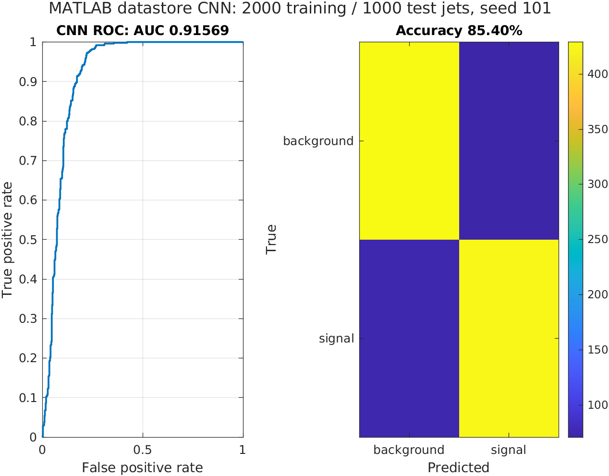

[Scores, resource measurements and verification](../experiments/project238-demo/).

## Required data workflow — verified 100k scaling check

The repaired datastore route completed one epoch on 100,000 training jets with
1,000 validation and 1,000 test jets. MATLAB exported this ROC and confusion
matrix; independent checks confirmed all selected test predictions. This is an
execution probe, separate from the three-seed 100k research study below.

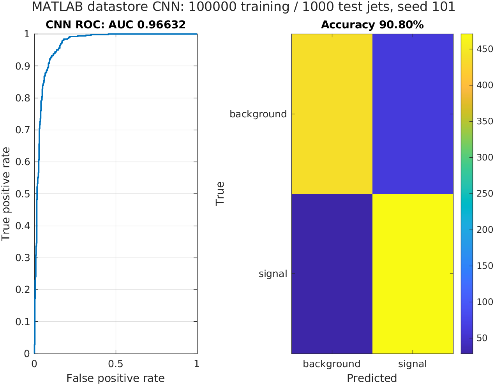

[Measurements, scores and verification](../experiments/project238-full/scale-check/).

## Final classification and noise study — verified

**Training:** 50,000 official training jets; 10,000 validation jets; three
training seeds per model; 12 epochs per fit.
**Plot renderer:** Python/Matplotlib, using verified MATLAB predictions.
These are research charts, not screenshots of the MATLAB desktop.

### Clean classification

All **404,000 official test jets**. Bars show mean accuracy and training-seed SD.

### Response to synthetic noise

The same **10,000 official test jets** at every noise level. Noise repeats are
averaged inside each training seed before calculating the plotted mean and SD.

[Measured tables and uncertainty](RESULTS.md) ·
[Saved evidence](../experiments/official-study/)

## Explanation of the final models — verified MATLAB exports

These figures use the frozen CNN and GraphSAGE checkpoints from **all three
training seeds**, trained on **50,000 jets**, and the first **10,000 official test
jets**. MATLAB R2024a generated both PNGs. No model was retrained or selected.

### Graph feature sensitivity

Shuffle one feature across particle nodes while keeping graph edges fixed.
Larger AUC drops indicate more sensitivity to that particular shuffle. The
three shuffles are averaged within each fitted model; error bars show SD across
the three training seeds, not nine independent trained models.

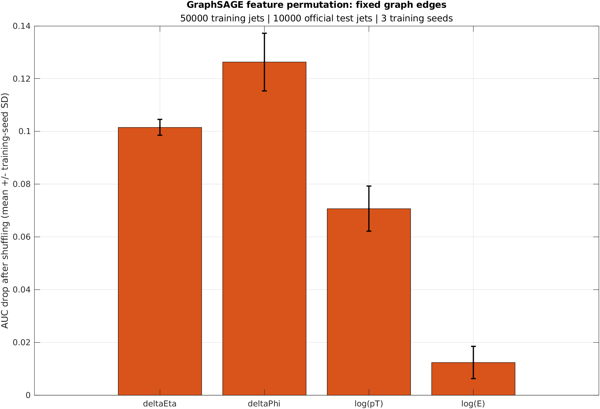

### Image-region sensitivity

Set pixels outside a central disk to zero, keeping the learned normalization
fixed. The x-axis measures **radius, not retained area**. A radius fraction of 1
preserves the entire image. Strong central cropping reduces AUC considerably.

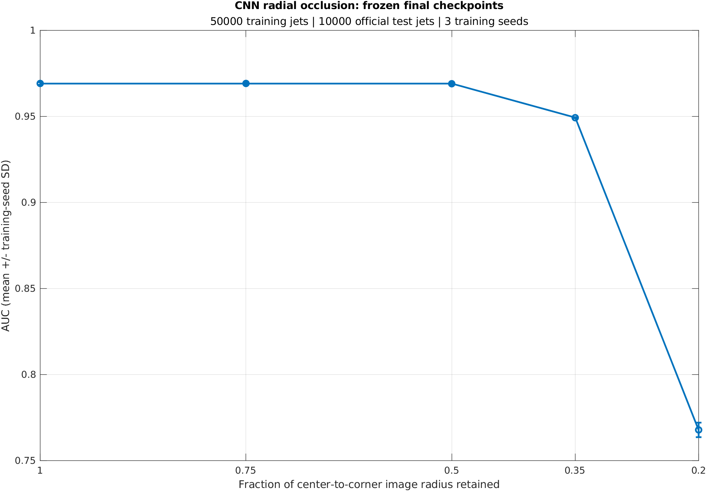

[Measured values, limitations, and reproduction](../experiments/explanations/README.md) ·
[Successful MATLAB run](https://github.com/AstroAli5/top-quark-tagging-ai-challenge/actions/runs/35709427585)

All 51 perturbation measurements were independently recalculated from the saved
probabilities. Checkpoint hashes match the original models. Small floating-point
differences in one restored model changed neither classifications nor clean AUC.

These explanation plots are specific to the original three 50k-trained core
models. The separate 100k explanation study appears below; the additional
50k seeds 404/505 are not part of either explanation study.

## Explanation of the 100k models — verified MATLAB exports

These new figures reuse all three CNN/GraphSAGE seed pairs trained on 100,000
jets and explain the first 10,000 official test jets. Clean predictions were
restored exactly; all six checkpoint hashes and all 51 perturbation measurements
passed independent verification. MATLAB R2024a generated both PNGs.

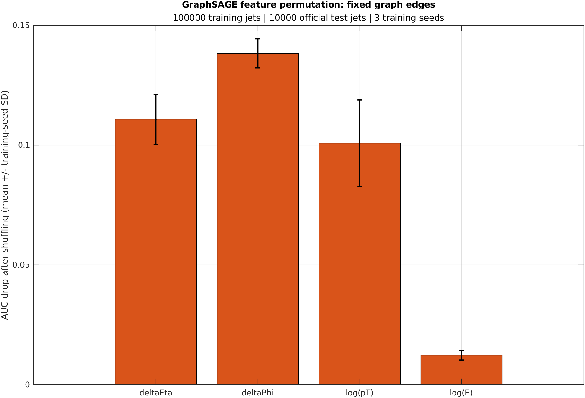
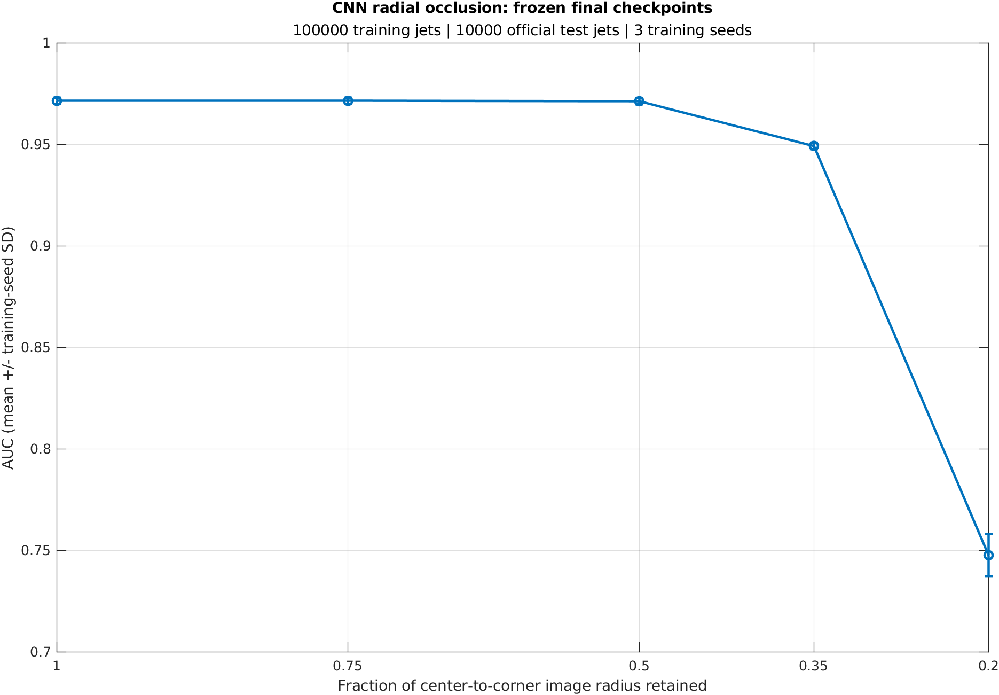

[Measured values and reproduction](../experiments/explanations-100k/). Error bars
show SD across three trained seeds. Graph edges stay fixed during feature
shuffling; the image-mask axis measures retained radius, not image area.

## Core follow-ups — verified MATLAB predictions, Python charts

### Five seeds at 50,000 training jets

Seeds 101/202/303/404/505, the same 10,000 validation jets, and 12 epochs.
Clean accuracy uses all 404,000 test jets; paired noise uses the first 10,000.
Error bars show training-seed SD. The reference is not part of this extension.

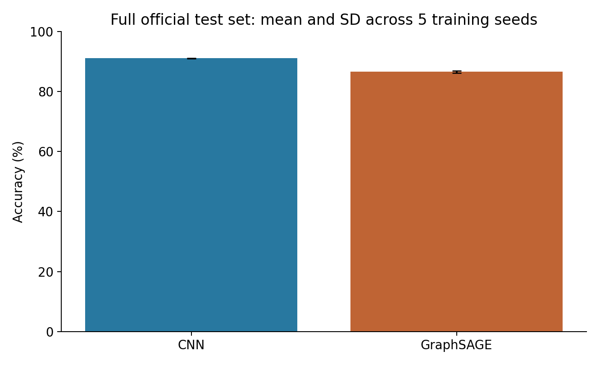
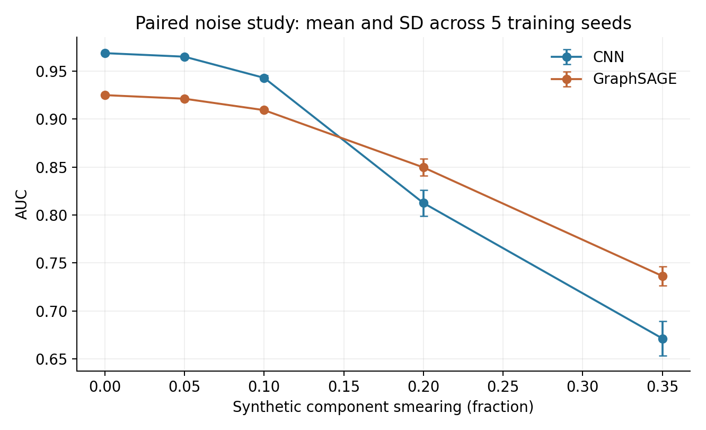

[Five-seed measurements, compatibility checks and provenance](../experiments/seed-extension/)

### Three seeds at 100,000 training jets

Seeds 101/202/303, with the same validation/test selections and epoch budget.
The paired comparison uses only those same three seed labels at 50k and 100k.
More jets at equal epochs also mean more optimizer updates.

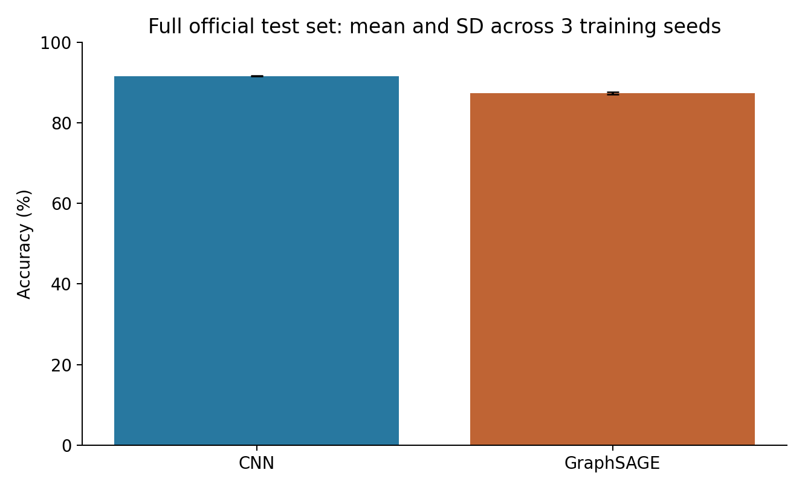
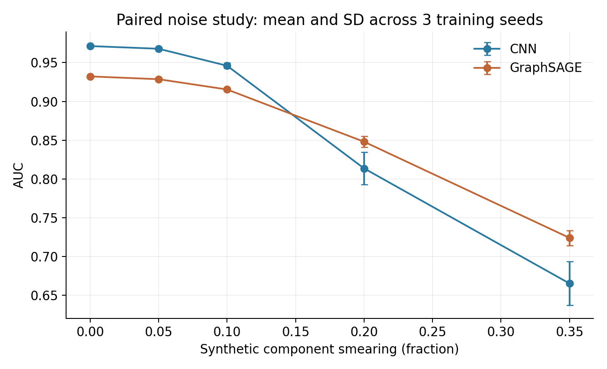

[100k measurements, paired intervals and measured memory](../experiments/scaling/).
Clean scores improved on average; GraphSAGE's strongest-noise AUC decreased.

## Optional quantum/classical pilot — verified Python export

Four matched features, 512 training and 256 validation jets per repeat,
2,000 fixed official test jets, and three fitting-sample repeats. Qiskit simulates
four qubits exactly on a CPU; the SVM optimization is classical. These are
different inputs and samples from the MATLAB study.

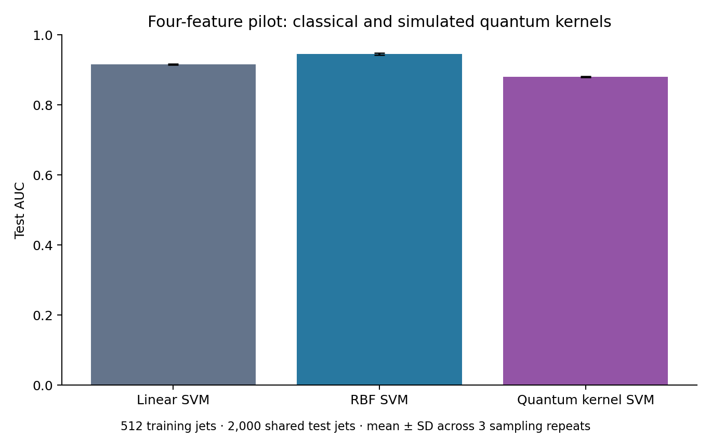

[Measured report and saved scores](../experiments/quantum-pilot/). The RBF baseline
performed better in this pilot; it does not demonstrate quantum advantage.

## Small demonstration — actual MATLAB exports

**Data:** the first 2,000 rows of the official training file, split into
1,400 training, 300 validation, and **300 internal test jets**.
**Training:** one seed per model, three epochs. **Renderer:** MATLAB R2024a.

All six original exports and their result tables are now saved in
[the small-run evidence folder](../experiments/small-benchmark/), so the figures
remain available after the original workflow artifact expires.

| File | What it shows |
| --- | --- |
| [roc_baseline.png](../experiments/small-benchmark/roc_baseline.png) | CNN and GraphSAGE ROC curves |
| [robustness_curves.png](../experiments/small-benchmark/robustness_curves.png) | Their accuracy and AUC under noise |
| [graphsage_feature_importance.png](../experiments/small-benchmark/graphsage_feature_importance.png) | AUC changes after graph features are shuffled |
| [cnn_radial_occlusion.png](../experiments/small-benchmark/cnn_radial_occlusion.png) | AUC when the outer image region is masked |
| [winner_roc.png](../experiments/small-benchmark/winner_roc.png) | Three-model ROC comparison |
| [winner_robustness.png](../experiments/small-benchmark/winner_robustness.png) | Three-model noise comparison |

View the six small-run MATLAB figures

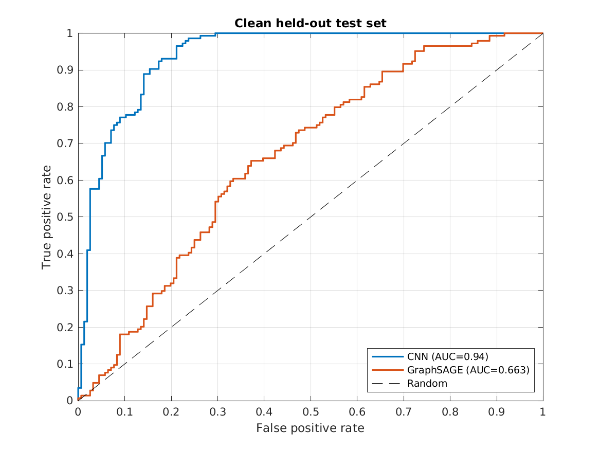
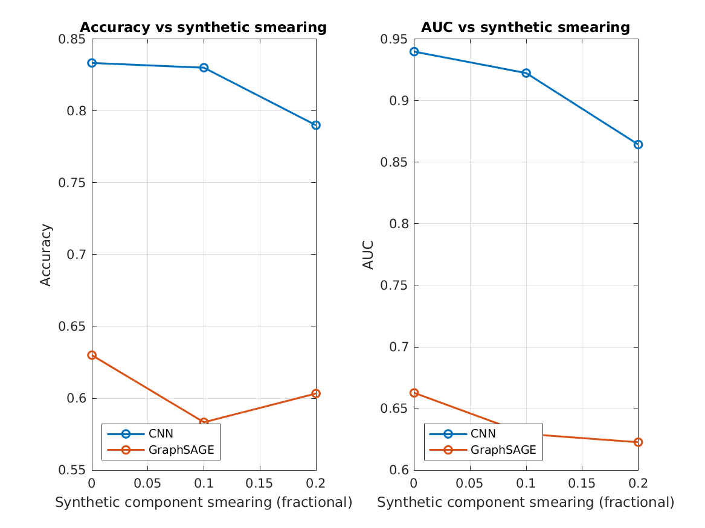
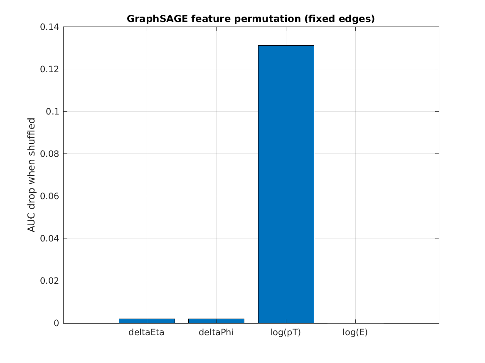
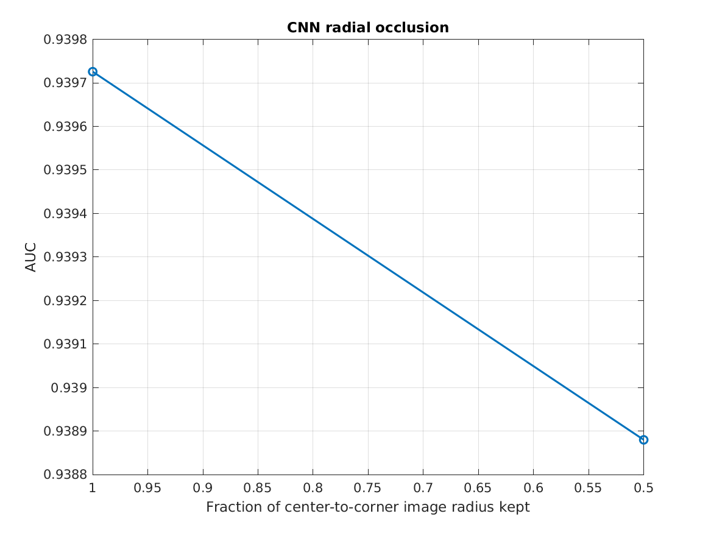
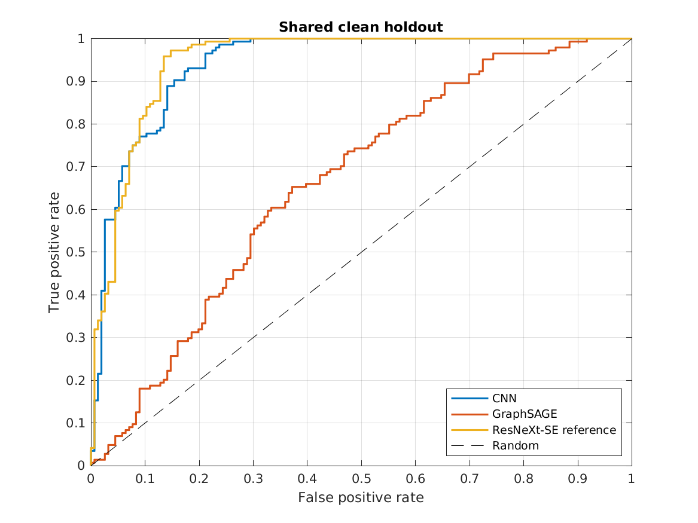
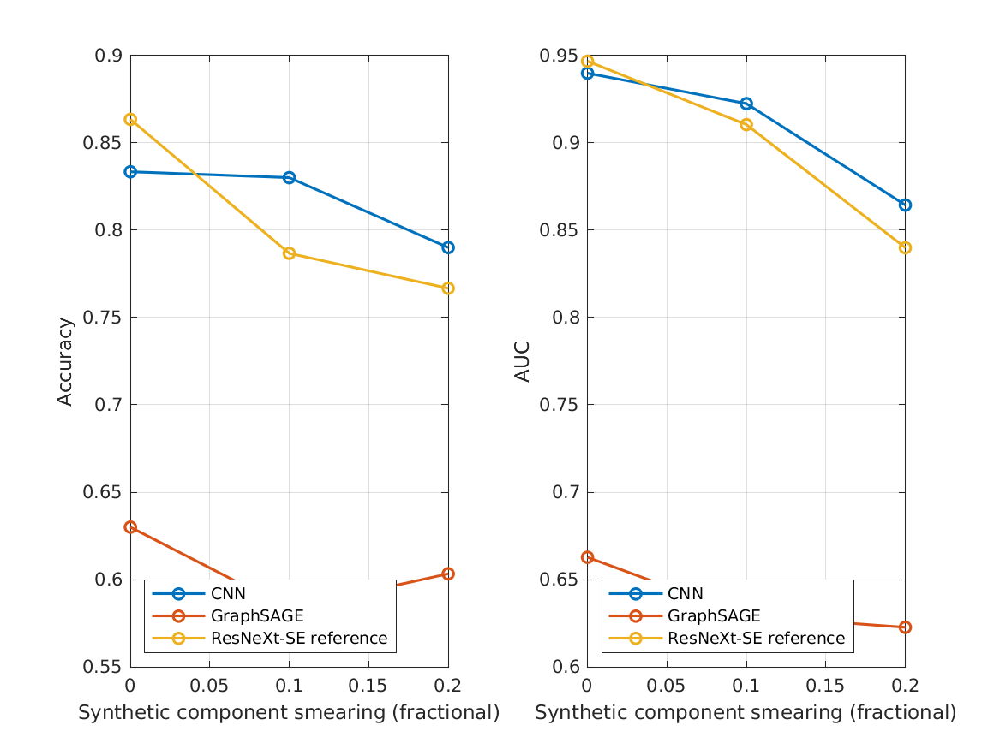

The explanation plots are sensitivity measurements. Shuffling correlated
features or masking image regions does not establish a causal physics explanation.
The [original run](https://github.com/AstroAli5/top-quark-tagging-ai-challenge/actions/runs/34936617829)
also holds the small trained models and predictions; that artifact currently
expires on 15 October 2026. The committed pictures and tables do not expire.

## Original figures — historical, unchanged

These four MATLAB exports were preserved from the original project. Its CNN
probability mapping and ROC implementation had unresolved issues, and its README
disagreed with its CSVs. These are a historical record, not corrected benchmark evidence.

| Clean ROC | Noise response |
| --- | --- |
| 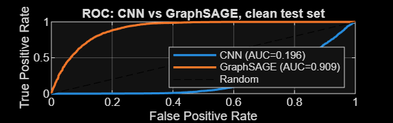 | 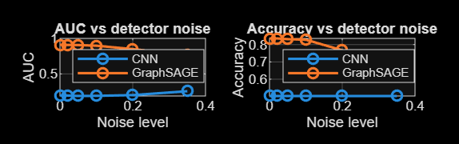 |

| Graph feature shuffling | Image radial occlusion |
| --- | --- |
| 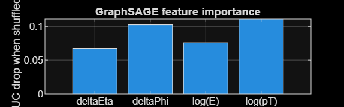 | 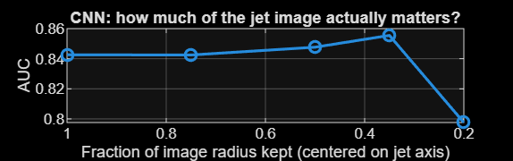 |

[Original files and caveats](../archive/original-results/README.md)

MATLAB training-progress windows were disabled for automated execution.
The available images are exported research plots, not recordings of those windows.

## Controlled graph edges, 100k training jets

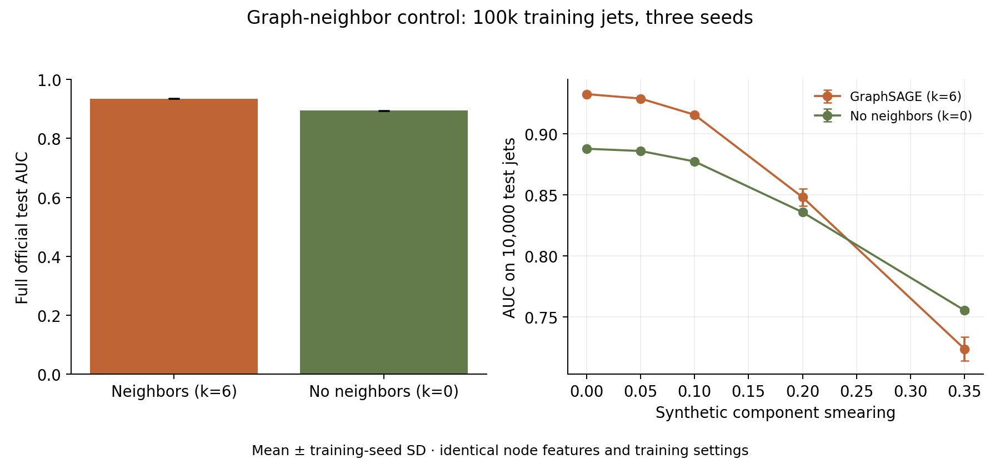

Python rendering from verified MATLAB predictions: 404,000 clean test jets,
10,000 noise-test jets and three training seeds. [Report](../experiments/graph-edges/).
