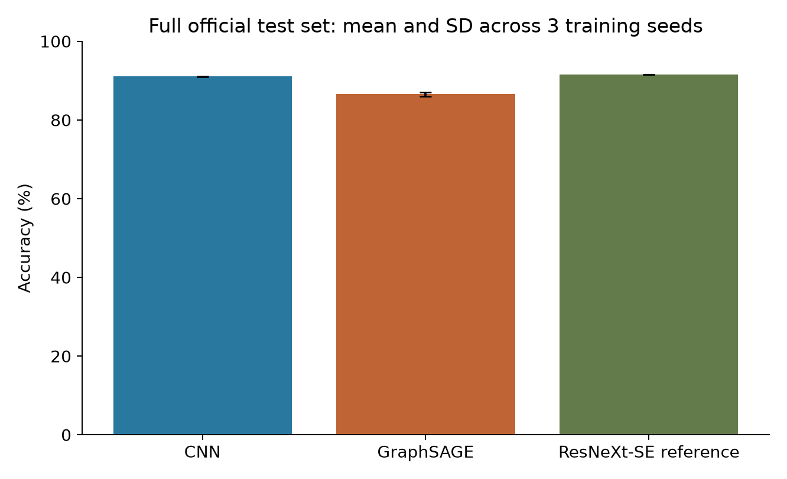
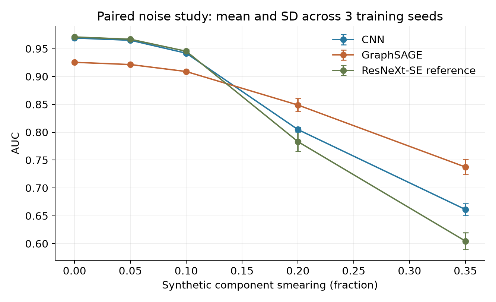

# Results and evidence

## Larger official-partition study

The three-model study is complete. The [core evaluation](https://github.com/AstroAli5/top-quark-tagging-ai-challenge/actions/runs/35095505566)
and [reference evaluation and combined analysis](https://github.com/AstroAli5/top-quark-tagging-ai-challenge/actions/runs/35148856141)
both passed. All saved predictions were downloaded and checked locally; the
recalculated report matches the workflow report exactly.
It uses 50,000 official training jets, 10,000 official validation jets, and all
404,000 official test jets (202,086 signal and 201,914 background). Training seeds
are 101, 202, and 303; every model trains for 12 epochs and selects its checkpoint
using validation loss. See the [fixed protocol](EXPERIMENT_PROTOCOL.md).

| Model | Clean accuracy, mean ± seed SD | Clean AUC, mean ± seed SD |
| --- | ---: | ---: |
| CNN | 91.06% ± 0.05 percentage points | 0.96929 ± 0.00072 |
| GraphSAGE | 86.58% ± 0.51 percentage points | 0.92769 ± 0.00046 |
| ResNeXt-SE reference | 91.59% ± 0.04 percentage points | 0.97159 ± 0.00011 |

The reference improves mean clean accuracy by 0.54 percentage points over CNN
under this budget. Mean training-function wall time was approximately 9.4 minutes
for CNN, 5.7 minutes for GraphSAGE, and 149 minutes for the reference. Core times
are reconstructed from log timestamps; reference times come from the saved timer.
Runner variation and preprocessing costs limit direct speed comparisons.

The [evidence folder](../experiments/official-study/) contains all per-seed values,
uncertainty tables, the machine-readable report, artifact hashes, and reproduction
instructions. The study uses a training subset; it is not a full-data benchmark
or a direct comparison with the 2025 winner's reported score.

### Noise sensitivity

These AUCs use the same first 10,000 test jets at every noise strength. The three
noise realizations are averaged within each training seed, then averaged across
the three training seeds. They are not nine independent fitted models.

| Synthetic smearing | CNN mean AUC | GraphSAGE mean AUC | Reference mean AUC |
| --- | ---: | ---: | ---: |
| 0% | 0.96905 | 0.92552 | 0.97102 |
| 5% | 0.96512 | 0.92148 | 0.96693 |
| 10% | 0.94185 | 0.90897 | 0.94538 |
| 20% | 0.80481 | 0.84886 | 0.78311 |
| 35% | 0.66130 | 0.73751 | 0.60460 |

**The core finding:** both image models score higher on clean data, but GraphSAGE
has the highest AUC at 20% and 35% smearing. That ranking holds in each of the three training runs
after averaging the paired noise realizations. The result supports a trade-off
between clean performance and sensitivity to this particular perturbation.
It does not establish that graph models are universally more robust.

### Uncertainty and verification

The 95% interval across training seeds for clean AUC is 0.96749–0.97108 for CNN
and 0.92656–0.92883 for GraphSAGE. The reference interval is 0.97132–0.97186.
These Student-t intervals use only three fitted
models per family, with the test data held fixed. The paired GraphSAGE-minus-CNN
AUC difference is −0.04159, with a seed interval of −0.04442 to −0.03876.
The reference-minus-CNN difference is +0.00230, with a seed interval of
+0.00030 to +0.00430. These differences concern the fitted pipelines and fixed
data in this study; they do not isolate the effect of any one architectural change.
Fixed-model test-sampling intervals are computed separately; the protocol explains
why the two kinds of uncertainty should not be conflated.

All consecutive test-row IDs, labels, seeds, configurations, and source-file
hashes were checked. Clean accuracy and AUC were recalculated from every saved
prediction, including a separate rank-based AUC calculation. Noise metrics were
checked against the saved probabilities with bounds for float32 rounding, and
zero-noise scores were checked against the same clean sample.

All six core checkpoints survived an earlier timeout during reference training.
They were reused without retraining. An overly strict test reader was corrected
to retain eight valid jets with one or two particles; no test rows were removed
and no model weights changed. The [protocol's recovery record](EXPERIMENT_PROTOCOL.md#execution-recovery-16-september-2026)
documents those implementation fixes and distinguishes training from evaluation
commits. No partial-run metrics are counted as completed results.

The software checks passed: 10 Python tests and 15 MATLAB tests, including data
partitioning, tied-score AUC, noise pairing, sparse valid jets, and a small
end-to-end experiment. Test fixtures are separate from the measured physics data.

## Verified small real-data run

[Completed run](https://github.com/AstroAli5/top-quark-tagging-ai-challenge/actions/runs/34936617829),
commit `ec0e3402c1c5130c2d00e975b941b64cd3308d1f`.

This used the first 2,000 rows of the official **training** file, split into
1,400 training, 300 validation, and 300 internal test jets. All three models
trained for three epochs. These measurements verify execution on real data;
the small holdout and single training seed limit scientific conclusions.

| Model | Accuracy | Clean AUC | AUC at 10% smearing | AUC at 20% smearing |
| --- | ---: | ---: | ---: | ---: |
| CNN | 83.33% | 0.93973 | 0.9223 | 0.8643 |
| GraphSAGE | 63.00% | 0.66275 | 0.6294 | 0.6227 |
| ResNeXt-SE reference | 86.33% | 0.94658 | 0.9103 | 0.8399 |

Values above were read from the completed MATLAB logs and saved result tables.
Clean accuracy and AUC were independently recomputed from all 300 saved prediction
rows in Python and matched the reported values. The run's artifact
contains its models, predictions, configuration, result tables, and plots.
The reference has the highest clean score in this small run; the CNN has the
higher AUC at the two shown nonzero noise levels. This is not a general model
ranking or an exact reproduction of the 2025 winner.

## Historical outputs

The [original CSVs and images](../archive/original-results/) are preserved
unchanged. Their clean values were CNN accuracy 50.29%, AUC 0.1961, and GraphSAGE
accuracy 83.57%, AUC 0.9088. They came from earlier code with unresolved
probability mapping and ROC issues.

Those files are historical records, not validated evidence for the corrected
code. The old and new runs also use different budgets and data selections, so
their numbers do not support a fair before-and-after accuracy claim.
