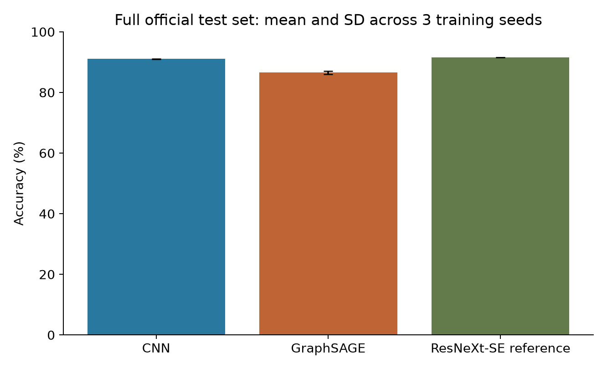
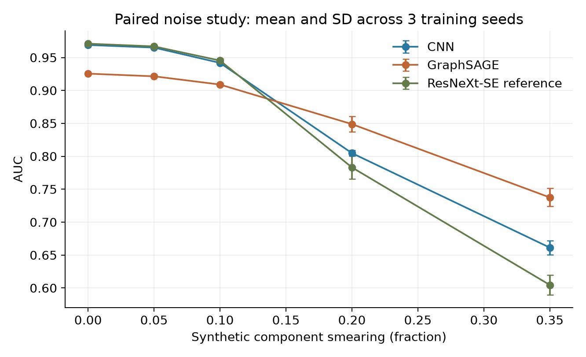
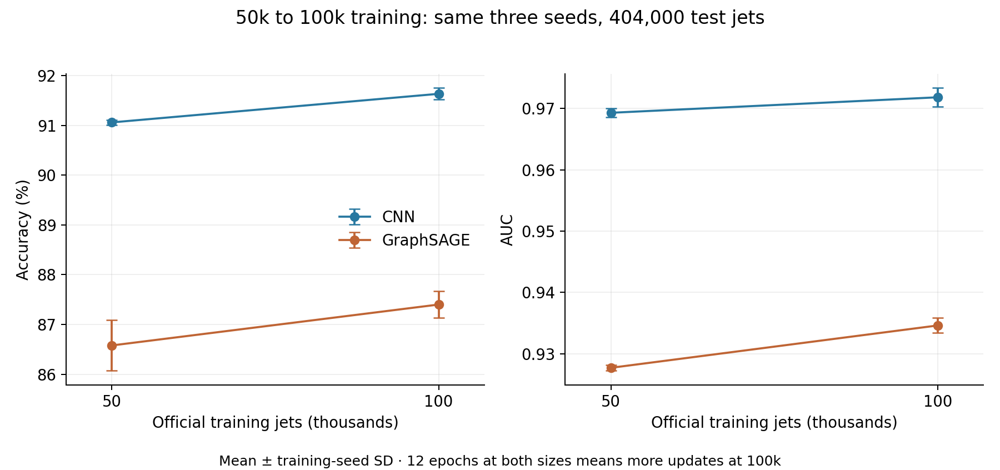

# Results and evidence

## Larger official-partition study

The three-model study is complete. The [core evaluation](https://github.com/AstroAli5/top-quark-tagging-ai-challenge/actions/runs/35095505566)
and [reference evaluation and combined analysis](https://github.com/AstroAli5/top-quark-tagging-ai-challenge/actions/runs/35148856141)
both passed. All saved predictions were downloaded and checked locally; the
recalculated report matches the workflow report exactly.
It uses 50,000 official training jets, 10,000 official validation jets, and all
404,000 official test jets (202,086 signal and 201,914 background). Training seeds
are 101, 202, and 303; every model trains for 12 epochs and selects its checkpoint
using validation loss. See the [fixed protocol](EXPERIMENT_PROTOCOL.md).

| Model | Clean accuracy, mean ± seed SD | Clean AUC, mean ± seed SD |
| --- | ---: | ---: |
| CNN | 91.06% ± 0.05 percentage points | 0.96929 ± 0.00072 |
| GraphSAGE | 86.58% ± 0.51 percentage points | 0.92769 ± 0.00046 |
| ResNeXt-SE reference | 91.59% ± 0.04 percentage points | 0.97159 ± 0.00011 |

The reference improves mean clean accuracy by 0.54 percentage points over CNN
under this budget. Mean training-function wall time was approximately 9.4 minutes
for CNN, 5.7 minutes for GraphSAGE, and 149 minutes for the reference. Core times
are reconstructed from log timestamps; reference times come from the saved timer.
Runner variation and preprocessing costs limit direct speed comparisons.

The [evidence folder](../experiments/official-study/) contains all per-seed values,
uncertainty tables, the machine-readable report, artifact hashes, and reproduction
instructions. The study uses a training subset; it is not a full-data benchmark
or a direct comparison with the 2025 winner's reported score.

### Noise sensitivity

These AUCs use the same first 10,000 test jets at every noise strength. The three
noise realizations are averaged within each training seed, then averaged across
the three training seeds. They are not nine independent fitted models.

| Synthetic smearing | CNN mean AUC | GraphSAGE mean AUC | Reference mean AUC |
| --- | ---: | ---: | ---: |
| 0% | 0.96905 | 0.92552 | 0.97102 |
| 5% | 0.96512 | 0.92148 | 0.96693 |
| 10% | 0.94185 | 0.90897 | 0.94538 |
| 20% | 0.80481 | 0.84886 | 0.78311 |
| 35% | 0.66130 | 0.73751 | 0.60460 |

**The core finding:** both image models score higher on clean data, but GraphSAGE
has the highest AUC at 20% and 35% smearing. That ranking holds in each of the three training runs
after averaging the paired noise realizations. The result supports a trade-off
between clean performance and sensitivity to this particular perturbation.
It does not establish that graph models are universally more robust.

### Uncertainty and verification

The 95% interval across training seeds for clean AUC is 0.96749–0.97108 for CNN
and 0.92656–0.92883 for GraphSAGE. The reference interval is 0.97132–0.97186.
These Student-t intervals use only three fitted
models per family, with the test data held fixed. The paired GraphSAGE-minus-CNN
AUC difference is −0.04159, with a seed interval of −0.04442 to −0.03876.
The reference-minus-CNN difference is +0.00230, with a seed interval of
+0.00030 to +0.00430. These differences concern the fitted pipelines and fixed
data in this study; they do not isolate the effect of any one architectural change.
Fixed-model test-sampling intervals are computed separately; the protocol explains
why the two kinds of uncertainty should not be conflated.

All consecutive test-row IDs, labels, seeds, configurations, and source-file
hashes were checked. Clean accuracy and AUC were recalculated from every saved
prediction, including a separate rank-based AUC calculation. Noise metrics were
checked against the saved probabilities with bounds for float32 rounding, and
zero-noise scores were checked against the same clean sample.

All six core checkpoints survived an earlier timeout during reference training.
They were reused without retraining. An overly strict test reader was corrected
to retain eight valid jets with one or two particles; no test rows were removed
and no model weights changed. The [protocol's recovery record](EXPERIMENT_PROTOCOL.md#execution-recovery-16-september-2026)
documents those implementation fixes and distinguishes training from evaluation
commits. No partial-run metrics are counted as completed results.

The software checks passed: 10 Python tests and 15 MATLAB tests, including data
partitioning, tied-score AUC, noise pairing, sparse valid jets, and a small
end-to-end experiment. Test fixtures are separate from the measured physics data.

## Final-model explanation study

[Completed MATLAB run](https://github.com/AstroAli5/top-quark-tagging-ai-challenge/actions/runs/35709427585),
22 September 2026. This reuses the final 50,000-jet-trained CNN and GraphSAGE
checkpoints for seeds 101, 202, and 303 on the first 10,000 official test jets.
It does not retrain models, change the classification/noise report, or select
hyperparameters from the explanatory results.

| Graph feature shuffled, fixed edges | Mean AUC drop | Training-seed SD |
| --- | ---: | ---: |
| deltaEta | 0.10154 | 0.00301 |
| deltaPhi | 0.12628 | 0.01094 |
| log(pT) | 0.07072 | 0.00856 |
| log(E) | 0.01236 | 0.00613 |

The fitted graph models are most sensitive to the angular-feature shuffles in
this experiment. Shuffling breaks correlations and leaves edges unchanged;
these are not causal importances or an isolated explanation of noise robustness.

| CNN radius fraction retained | Mean AUC | Training-seed SD |
| --- | ---: | ---: |
| 1.00 | 0.96905 | 0.00075 |
| 0.75 | 0.96905 | 0.00075 |
| 0.50 | 0.96890 | 0.00073 |
| 0.35 | 0.94915 | 0.00032 |
| 0.20 | 0.76774 | 0.00423 |

Retaining half the center-to-corner radius preserves nearly all clean AUC;
the strongest central crop substantially reduces it. Radius fractions are not
area fractions. Both analyses use fixed trained models and retained normalization.

All 36 feature-shuffle measurements and 15 radial-mask measurements were
recomputed independently with a rank-based AUC formula. Six checkpoint hashes
match the source artifacts. The rerun changes no clean classifications or AUCs;
one seed has a maximum probability difference of 0.00000316 from float arithmetic.
See [the MATLAB figures](FIGURES.md#explanation-of-the-final-models--verified-matlab-exports)
and [the complete explanation evidence](../experiments/explanations/).

## Verified core follow-ups: five seeds and 100k training

Both follow-ups completed on 23 September 2026. Their results are recorded
separately from the original three-model report.

| Training selection | Seeds per core model | CNN accuracy | GraphSAGE accuracy | CNN AUC | GraphSAGE AUC |
| --- | ---: | ---: | ---: | ---: | ---: |
| 50k, original core fits | 3 | 91.059% | 86.579% | 0.96929 | 0.92769 |
| 50k, extended core study | 5 | 91.063% | 86.583% | 0.96899 | 0.92707 |
| 100k, larger-subset study | 3 | 91.633% | 87.400% | 0.97181 | 0.93460 |

All rows evaluate every official test jet. The [five-seed report](../experiments/seed-extension/)
verifies implementation and data compatibility before combining seeds 404/505
with 101/202/303. Accuracy SDs are 0.040 and 0.361 percentage points; AUC SDs
are 0.00065 and 0.00092 for CNN and GraphSAGE, respectively. All clean scores
and 150 noise-metric rows passed independent prediction checks.

The [100k report](../experiments/scaling/) uses seeds 101/202/303, matching the
first row. Mean accuracy increases are +0.574 percentage points for CNN and
+0.822 for GraphSAGE. The paired 95% seed intervals are +0.197 to +0.950 and
−0.986 to +2.630 points; the GraphSAGE accuracy interval includes zero. AUC
increases are +0.00253 and +0.00691. Test rows/labels, training settings, model
implementation and MATLAB version match. All 90 noise-metric rows also passed.

Both sizes use 12 epochs, so 100k also receives more optimizer updates. This
does not isolate a pure data effect or compare equal compute. GraphSAGE still
has higher mean AUC at 20%/35% smearing, but its mean 35%-noise AUC decreases
from 0.73751 at 50k to 0.72382 at 100k. Improved clean scores do not imply
uniformly improved robustness.

Measured MATLAB-process peak RAM at 100k was 3.68–3.73 GiB. The
[resource record](../experiments/scaling/resources.json) distinguishes this
measurement from the conservative 12.33 GiB planning estimate. The reference
has no 100k or five-seed result. The explanation study above applies only to
the original three 50k core checkpoints; the 100k explanation study below is
separate. Neither follow-up uses all available training data or establishes
competition placement.

## Verified explanations of the 100k models

[Completed MATLAB run](https://github.com/AstroAli5/top-quark-tagging-ai-challenge/actions/runs/36158770932),
25 September 2026. All three frozen 100k CNN/GraphSAGE checkpoint pairs were
explained on 10,000 official test jets. Restored clean probabilities matched
the source predictions exactly. All 36 feature-shuffle and 15 radial-mask
measurements, along with six checkpoint hashes, passed independent verification.

Mean graph AUC drops are **0.11071 for deltaEta**, **0.13822 for deltaPhi**,
**0.10069 for log(pT)** and **0.01220 for log(E)**. For CNN, mean AUC changes
from **0.97137** with the whole image to **0.97122** at half radius and
**0.74756** at a 0.20 radius fraction. These are sensitivity measurements with
normalization held fixed, not causal importances. The
[complete report](../experiments/explanations-100k/) gives seed variability,
per-repeat values, source provenance and the two actual MATLAB exports.

## Optional four-qubit simulator pilot

The [separate pilot](../experiments/quantum-pilot/) is complete and verified:
512 training jets and 256 validation jets per repeat, the same 2,000 official
test jets, four matched features, and three fitting-sample repeats.

| Kernel | Mean test AUC ± sampling SD | Mean accuracy |
| --- | --- | --- |
| Linear | 0.91549 ± 0.00165 | 88.37% |
| RBF | 0.94508 ± 0.00306 | 88.63% |
| Four-qubit simulated fidelity | 0.88045 ± 0.00140 | 82.80% |

The classical RBF baseline performed better here. These small-sample, engineered-
feature results are not directly comparable with the larger MATLAB study and
do not demonstrate quantum advantage. No quantum device was used.

## Verified small real-data run

[Completed run](https://github.com/AstroAli5/top-quark-tagging-ai-challenge/actions/runs/34936617829),
commit `ec0e3402c1c5130c2d00e975b941b64cd3308d1f`.

This used the first 2,000 rows of the official **training** file, split into
1,400 training, 300 validation, and 300 internal test jets. All three models
trained for three epochs. These measurements verify execution on real data;
the small holdout and single training seed limit scientific conclusions.

| Model | Accuracy | Clean AUC | AUC at 10% smearing | AUC at 20% smearing |
| --- | ---: | ---: | ---: | ---: |
| CNN | 83.33% | 0.93973 | 0.9223 | 0.8643 |
| GraphSAGE | 63.00% | 0.66275 | 0.6294 | 0.6227 |
| ResNeXt-SE reference | 86.33% | 0.94658 | 0.9103 | 0.8399 |

Values above were read from the completed MATLAB logs and saved result tables.
Clean accuracy and AUC were independently recomputed from all 300 saved prediction
rows in Python and matched the reported values. The run's artifact
contains its models, predictions, configuration, result tables, and plots.
The reference has the highest clean score in this small run; the CNN has the
higher AUC at the two shown nonzero noise levels. This is not a general model
ranking or an exact reproduction of the 2025 winner.

## Historical outputs

The [original CSVs and images](../archive/original-results/) are preserved
unchanged. Their clean values were CNN accuracy 50.29%, AUC 0.1961, and GraphSAGE
accuracy 83.57%, AUC 0.9088. They came from earlier code with unresolved
probability mapping and ROC issues.

Those files are historical records, not validated evidence for the corrected
code. The old and new runs also use different budgets and data selections, so
their numbers do not support a fair before-and-after accuracy claim.

## Controlled graph-neighbor study, 100k training jets

[Verified report](../experiments/graph-edges/): clean mean AUC was 0.93460
with six neighbors and 0.89371 with zero neighbors across the same three seeds.
The zero-neighbor variant did better under 35% synthetic smearing. This tests
message passing within one implementation; it does not isolate architecture
across CNN and GraphSAGE.
