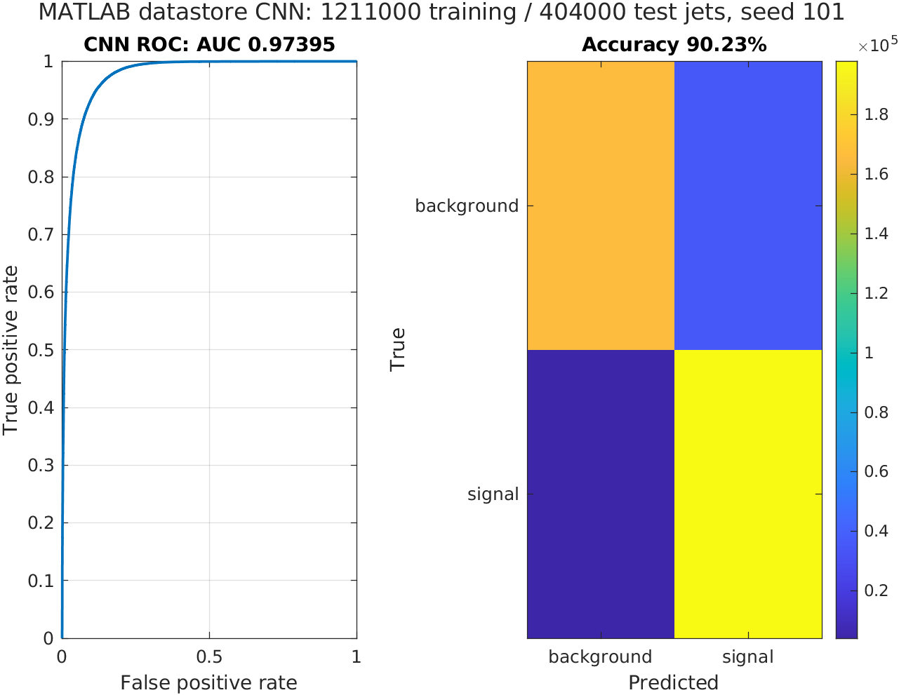

# Verified full-source MATLAB feasibility run

The second attempt **completed and passed independent prediction checks** on
28 September 2026. MATLAB trained a compact CNN for one epoch on **all 1,211,000
official training jets**, selected its network using **10,000 validation jets**,
and evaluated **all 404,000 official test jets**. Seed 101, CPU, batch size 100;
the log confirms all **12,110 training iterations** and the maximum-epoch stop.

[Predeclared protocol](PROTOCOL.md) ·
[Successful workflow](https://github.com/AstroAli5/top-quark-tagging-ai-challenge/actions/runs/36390331331).

| Measurement | Observed value |
| --- | ---: |
| Full-test accuracy at threshold 0.5 | 90.2267% |
| Full-test AUC | 0.9739505904 |
| Source verification and HDF5 → Parquet | 178.59 s / 2.98 min |
| Tall image creation and coverage checks | 1,236.76 s / 20.61 min |
| CNN training | 2,119.50 s / 35.32 min |
| Test inference and metrics | 371.83 s / 6.20 min |
| MATLAB process peak resident memory | 4.76 GiB |
| Separate Python process peak resident memory | 0.47 GiB |

The CPU runner had four CPUs, 15.61 GiB total memory and 78.55 GiB free disk before
execution. Memory peaks are separate process measurements, not an exact combined
peak or a minimum system requirement. Raw HDF5 files came from the workflow
cache, so preparation includes checksum verification and conversion, not a fresh
download. Pipeline start to printed report was about 66.44 minutes; stage totals
exclude some datastore reopening, figure export and other overhead.



## Verification and retained evidence

The workflow checked all 404,000 source row IDs and labels against the
checksum-verified official HDF5 test file, MAT/CSV score agreement, model hash,
accuracy and AUC. A second local calculation used SciPy average ranks for AUC
and independently reproduced both metrics from every saved prediction.
An additional local label check matched 80,000 rows from checksum-verified older
MAT chunks; one recovered scratch chunk failed its checksum and was excluded,
with the mismatch recorded in the audit. That cache was not used for this run.

The confusion matrix, in background/signal order with true classes as rows and
predictions as columns, is `[[166581,35333],[4151,197935]]`.

[Exact MATLAB report and source/chunk manifest](attempt2/report.json) ·
[Workflow verification](attempt2/verification.json) ·
[Independent local verification](attempt2/local_verification.json) ·
[Runner resources](attempt2/runner.json) ·
[Stage timings](attempt2/stage_times.json) ·
[Artifact identity, model and prediction hashes](attempt2/artifact.json).

The linked workflow's `project238-full-source-one-epoch` artifact contains the
trained model, epoch checkpoint and all per-jet MAT/CSV predictions. Its recorded
expiry is **27 December 2026**. The compact reports and MATLAB figure above are
retained in Git; this artifact expiry is not permanent checkpoint hosting.

## What this establishes

The required MATLAB-hosted Python → Parquet → tall images → folder-labelled
imageDatastore → CNN route now executes at full training and test size on the
available CPU runner. Batch size 100 divides the training count exactly, so no
training rows form a discarded partial minibatch. The official validation
partition is still a 10,000-row subset.

This is **one epoch and one seed**, not a convergence study or the default
12-epoch run. It does not measure seed uncertainty, controlled architecture
differences, GPU acceleration, quantum advantage or reviewer acceptance.
The earlier 50k/100k multi-seed studies remain separate. Their preprocessing and
training budgets differ; this run is not a controlled test of dataset size.
The existing explanation plots cover those earlier models, not this new CNN.

## First attempt and repair

The first attempt on 27 September hit its 305-minute limit before training. It
converted the selected source rows to Parquet in 185.72 seconds, then stalled
during image preparation/validation. No model or test score came from that run.
[Failed-attempt record](attempt1.json) · [Last saved stage](attempt1_stage_times.json) ·
[Original logs](https://github.com/AstroAli5/top-quark-tagging-ai-challenge/actions/runs/36281531930).

The repair caches the datastore file list once instead of reading the complete
property for each filename. It passed the separately verified [100k probe](scale-check/)
before this retry. The full run opened and validated the 1,211,000 training
filenames in 46.9 seconds and the 404,000 test filenames in 16.4 seconds.
The old logs did not distinguish final write bookkeeping from datastore work;
these observations support the repair without assigning an exact causal speedup.

## Reproduce the one-epoch run

Follow the Python/MATLAB setup in the main README, then use new data/output
folders to preserve existing results:

```matlab
cfg = project238Config;
cfg.epochs = 1;
cfg.batchSize = 100;
cfg.dataDir = fullfile(cfg.rootDir,'data','project238_full_retry');
cfg.outputDir = fullfile(cfg.rootDir,'runs','project238_full_retry');
run_project238(cfg)
```

```bash
python scripts/verify_project238.py --run runs/project238_full_retry --raw-test data/test.h5
```
