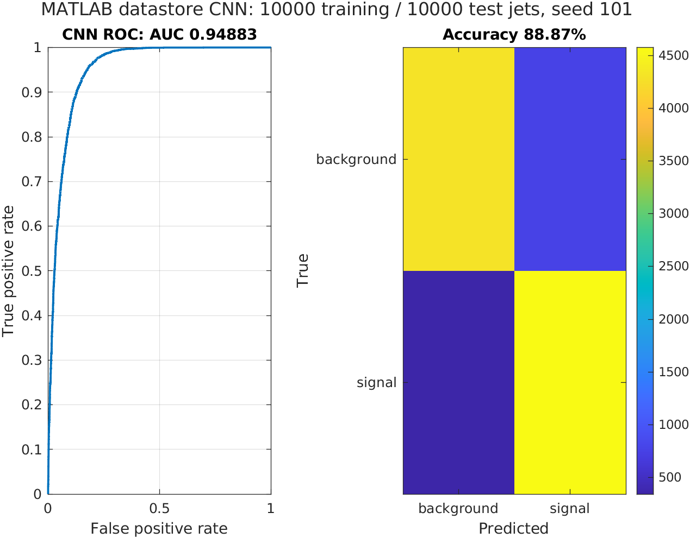

# Named ResNet18: matched image pilot

Completed on 30 September 2026 in MATLAB R2024a, on CPU. Both models used the
same 10,000 training / 2,000 validation / 10,000 test jets, 32×32 floating-point
grayscale images, seed 101, Adam and three epochs. The
[protocol](PROTOCOL.md) was committed before the run.

| Model | Test accuracy | Test ROC AUC | Training time | Test evaluation time |
| --- | ---: | ---: | ---: | ---: |
| Compact CNN | 89.03% | 0.952204 | 61.02 s | 7.22 s |
| Named ResNet18 | 88.87% | 0.948833 | 486.63 s | 31.76 s |

**Under this small budget, ResNet18 did not improve the result.** It took about
8.0 times the training time on the same runner. One seed and three epochs do
not establish general architecture superiority or a converged ResNet18 result.
Training times exclude data preparation and test evaluation.

The model starts from the named MathWorks `resnet18(Weights='none')` architecture.
The input and first convolution accept one channel, global average pooling
accepts the smaller spatial representation, and the classifier has two outputs.
The eight residual blocks are retained. All weights are learned from scratch;
this is not an ImageNet-pretrained transfer-learning result or an unmodified
224×224 RGB benchmark. The existing ResNeXt-SE reference is a different model.

This is a narrower architecture comparison than the historical image/graph
study: selected rows, representation and training settings are matched, while
parameter count and compute differ. The test set was not used to tune the pilot.
Do not compare these subset scores directly with the full-source headline.

## Evidence and MATLAB figures

| Evidence | Compact CNN | ResNet18 |
| --- | --- | --- |
| Full run report | [report.json](compact/report.json) | [report.json](resnet18/report.json) |
| Independent source/score/hash verification | [verification.json](compact/verification.json) | [verification.json](resnet18/verification.json) |
| MATLAB ROC and confusion matrix | [Figure](compact/matlab_evaluation.png) | [Figure](resnet18/matlab_evaluation.png) |

[Comparison CSV](comparison.csv) · [Local independent recalculation](local_verification.json)

View the named ResNet18 MATLAB export

The shared plotting function uses the general label “CNN.” The file, saved
report and checkpoint identity identify this specific result as ResNet18.

Both predictions were checked against the official HDF5 test rows in the
[successful workflow](https://github.com/AstroAli5/top-quark-tagging-ai-challenge/actions/runs/36701925315/job/109843142939).
The local recalculation independently uses SciPy average ranks for the
Mann–Whitney AUC and a fixed 0.5 threshold for accuracy; both agree with MATLAB
and the CI verifier within 1e-12. Manifests, selected IDs/labels and training
settings also match across models. Per-jet CSVs are not committed in this Git update. The local CSV check does not reload weights;
the workflow checks the saved checkpoint hashes and MAT/CSV consistency.

Code head: `4e611b76bd7fa9cfe7106b2775fa3750282c141c`; GitHub tested merge commit:
`9f77de9dfadbc3a10c979b4262e57c94d13f8709`. The initial
[successful training job](https://github.com/AstroAli5/top-quark-tagging-ai-challenge/actions/runs/36697779857/job/109829778211)
was repeated without changing training code while repairing the separate HDL
dependency and adding the small report artifact. It is the same seed, not a
second independent training seed. The second run is the canonical evidence here.

The [full artifact](https://github.com/AstroAli5/top-quark-tagging-ai-challenge/actions/runs/36701925315/artifacts/11091086886)
contains both models, epoch checkpoints and MAT predictions; it expires on
29 December 2026. Aggregate reports, verification records and figures are retained in Git. These
optional models are separate from the permanent three-model quick-check bundle.

## Reproduce

Use the Python/MATLAB setup in the root README and run `run_resnet18_study`.
Then run `scripts/verify_project238.py` for each `runs/resnet18-pilot/<model>`
folder, supplying `--raw-test data/test.h5`. The
[optional workflow](../../.github/workflows/optional-review.yml) can be launched
manually; normal unit tests check the named architecture without refitting this
study on every documentation change.
